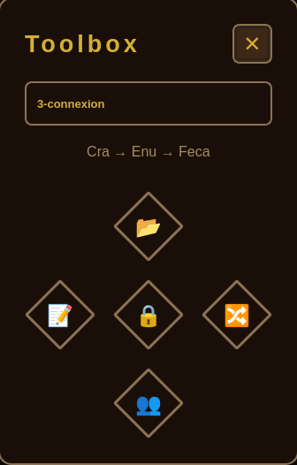

# Dofus Linux toolbox

Gestionnaire multi-comptes pour Dofus sur Linux.

Testé sur Linux Mint 22 Cinnamon 

## UI du programme



## Installation

Installer les dépendances:
```bash
sudo apt install python3-pyqt5 wmctrl xdotool xprop pulseaudio-utils
pip3 install python-dotenv
```

Configuration:
```bash
chmod +x dofus_control_gui.py
```

## Configuration

Créer/MAJ le `.env` dans le répertoire du projet:
```
DISPLAY=:0
PROFILES_DIR=/home/$USER/.config/dofus_linux_toolbox
```

Met a jour le fichier JSON des profils (`~/profiles.json`):
```json
{
  "active": "Initiative",
  "profiles": {
    "Initiative": {
      "windows": ["Feca", "Cra", "Enu", "Panda", "Sadi"],
      "characters": ["Feca_Name", "Cra_Name", "Enu_Name", "Panda_Name", "Sadi_Name"]
    }
  }
}
```

## Utilisation

Lancer l'application:
```bash
python3 dofus_control_gui.py
```

### Boutons

- **⬇ Charger**: Charge un fichier JSON de profils
- **✎ Renommer**: Renomme les fenêtres selon le profil actif et mute les autres
- **🔒 Lock**: Active/désactive le verrouillage au premier plan
- **↻ Réorganiser**: Réorganise les fenêtres entre espaces de travail
- **👥 Inviter**: Lance la macro d'invites groupe

### Format du Profil

Chaque profil doit contenir:
- `windows`: Liste des noms de fenêtres (doivent correspondre aux titres Dofus)
- `characters`: Liste des noms de personnages (pour renommer et invites)

### Macro d'Invites

1. Clique sur le bouton d'invites
2. Positionne le curseur dans la barre de chat et clique
3. Attends 1.5 seconde
4. La macro envoie automatiquement `/invite NOM` pour chaque personnage

## Structure des fichiers

```
dofus_linux_toolbox/
├── .env
├── dofus_control_gui.py
├── profiles.json
└── scripts/
    ├── cycle_windows_dofus.sh
    ├── cycle_backward_windows_dofus.sh
    ├── click_cycle_windows_dofus.sh
    └── toggle_workspace.sh
```

## Raccourcis clavier - A bind avec des touches clavier/souris:

```bash
# Cycler forward
~/dofus_linux_toolbox/scripts/cycle_windows_dofus.sh

# Cycler backward
~/dofus_linux_toolbox/scripts/cycle_backward_windows_dofus.sh

# Clic + Cycler forward
~/dofus_linux_toolbox/scripts/click_cycle_windows_dofus.sh

# cycler sur les workspaces
~/dofus_linux_toolbox/scripts/toggle_workspace.sh

```

```bash
# Créer l'app desktop - la mienne est dans documents, donc les chemins sont a MAJ
cat > ~/.local/share/applications/dofus-control.desktop << 'EOF'
[Desktop Entry]
Version=1.0
Type=Application
Name=Dofus Control
Comment=Multi-account manager for Dofus
Exec=python3 /home/$USER/Documents/dofus_linux_toolbox/dofus_control_gui.py
Icon=application-x-executable
Categories=Utility;
Terminal=false
StartupNotify=true
EOF

```
